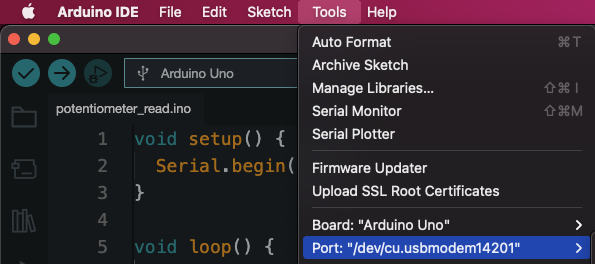
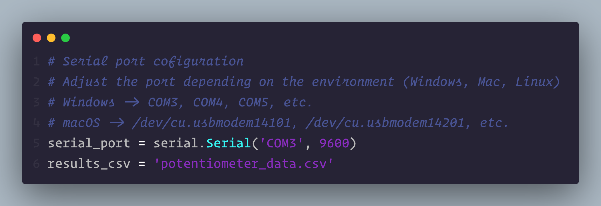
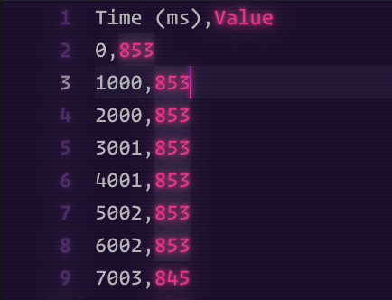

# Arduino Pot

A basic project for reading the data from a potentiometer connected to an Arduino UNO board and saving it as a CSV format using Python.

| Authors                    |
| -------------------------- |
| Irving Alain Aguilar Perez |
| Karla Daniela Marin Rangel |

## Usage

1. Compile and upload the code from `arduino/potentiometer_read.ino` to your Arduino UNO board.
2. Check the assigned COM port in the Arduino IDE software.

    

3. Open the `python/read_com.py` file with the text editor of your preference ([Visual Studio Code](https://code.visualstudio.com/) is highly recommended).
4. Install the `pyserial` library using the following command:
   - **Windows**
   ```bash=
   python -m pip install pyserial
   ```
   - **macOS**
   ```bash=
   pip3 install pyserial
   ```
5. Edit the serial port to match the port shown inside the Arduino IDE.

   

6. Run the python script using the terminal of your preference:
   - **Windows**
   ```bash=
   python read_com.py
   ```
   - **macOS**
   ```bash=
   python3 read_com.py
   ```
7. Stop the python file using the `Ctrl C` keyboard shortcut.
8. Now you can visualize the data obtained as CSV format in the `potentiometer_data.csv` file.

    